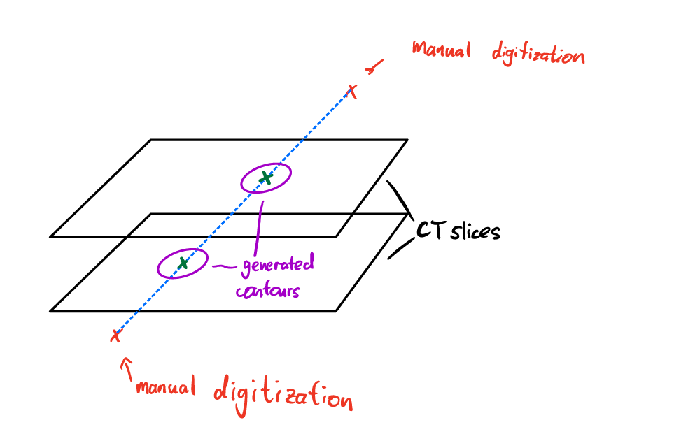

# Milosh Cathter Digitization

When you create the catheter structure it takes the manual series of 3D points and converts them into catheter volumes. The script can be found in the src/Catheter_Ellipse_Path_Finder.py . Here is how it works:

The script takes the catheter points and the slice thicknesses as input. 

It takes 2 points at a time, connects them via a straight line, and finds the intersections of that line with the CT slices. 

Based on the angle of intersection and the diameter of the catheter, the script then creates an elliptical contour of the catheter on that slice. You can imagine this as if you took a cylinder at an angle and took the cross-section.

Finally, we check which pixels/voxels fall into these newly created contours in order to label them as "catheter" for the 3D mask volume.

Everything is run from the "applicator_extractor.py" script

To run, simply configure the following user variables (clearly distinguished and explained at the beginning of the script):

the "parent_folder" should be the path to the folder that contains the DICOM information

The parent folder should contain one folder for each patient

The "path" variable is the path to the destination folder to save your images and masks. Thus it needs to contain an "image" and a "label" folder

The "resolution" variable lets you control to what voxel resolution you want to resample your volume. It is specified in vox/mm"

The "window_in_mm" is the height and width of the field that will be cropped from the center of the axial plane

"skip_duplicates" will skip patient information if you have already saved a treatment plan from the same patient (You can leave it as False)

"crop_dwells" will keep only the volume above the lowest dwell position and below 10 slices superior to the most superior dwell position. This is what we consider the clinically relevant volume. 

"num_to_plot" is the number of images you want to visualize as you save them. This is a sanity check method to make sure that the labels match the images. It will show you "num_to_plot" many images before saving the rest without sanity checks. You probably won't need this once you change the code, but I would highly recommend implementing something similar. Sanity checks are super important! 

"make_folders" will make folders for every patient in the image and mask folders. This was useful for me because every patient had multiple images and mask images (since I did 2D), but you probably won't need this. 
