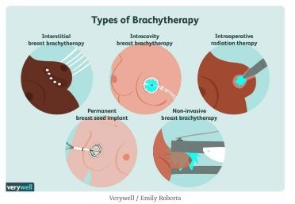
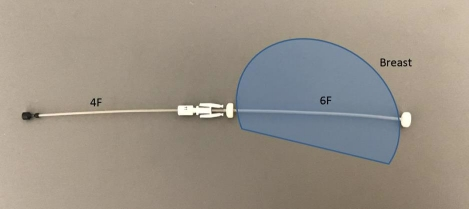
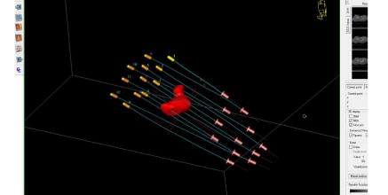
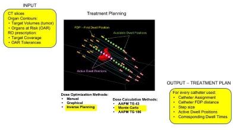
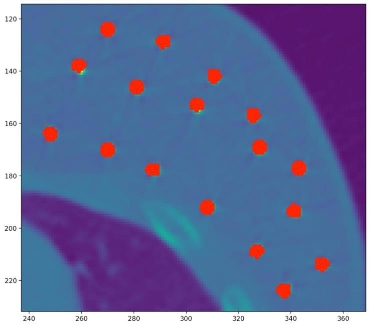
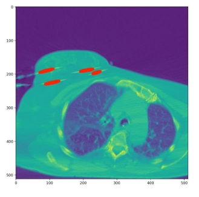
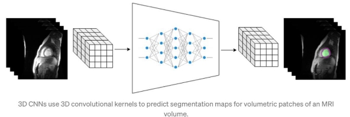
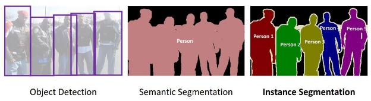

22/01/2022 

Deep Learning-Based Brachytherapy Catheter Reconstruction for Breast Cancer Patients 

by Milosh Dević 

**Table of content:** 

1) [Introduction ](#_page1_x69.00_y72.00)
1) [Initial researching ](#_page3_x69.00_y210.00)
1) [DICOM files ](#_page3_x69.00_y243.00)
1) [Related papers and articles ](#_page3_x69.00_y493.00)
3) [Preprocessing the data ](#_page4_x69.00_y211.00)
3) [Training ](#_page5_x69.00_y362.00)
   1) [Choosing the right model ](#_page5_x69.00_y399.00)
   1) [Handling memory problems ](#_page6_x69.00_y354.00)
3) [Results ](#_page7_x69.00_y72.00)
3) [Conclusion ](#_page10_x69.00_y72.00)
1) **Introduction** 

The project, as the name suggests, consisted of developing a deep learning algorithm in order to automatically reconstruct catheters in 3D for breast cancer patients undergoing brachytherapy treatment. Before going into the core of the project, what is brachytherapy? 

Brachytherapy (or Curietherapy) is a form of radiotherapy where a sealed radiation source is placed inside or next to the area requiring treatment within the patient. There are different types of brachytherapy (as seen in Fig. 1). The one that corresponds to the project is interstitial breast brachytherapy. 

[Fig. 1: Different types of brachytherapy] 

Fig. 2 illustrates the workflow of brachytherapy, on which you can see different steps of the treatment. Catheter reconstruction is the step that concerns this project. 

[Fig. 2: Brachytherapy workflow] 

(RO: Radio Oncologist, RTT: Radiotherapy Therapist, Phys: Medical Physicist) The plastic catheters, which have the shape of needles (Fig. 3), are inserted into the patient’s breast inside and around the treatment site (tumour bed after surgery) using an assembled comfort catheters system. The “6F” flexi-catheter (has a larger diameter) passes through the breast and is clipped with two buttons on each side to hold it in place. Then, a smaller diameter (4F) catheter is inserted into the flexi-catheter and a CT marker is inserted inside each “4F” catheter before scanning the area. The CT marker is made of Fluor, so it appears as white on the CT images. This enables the medical physicist to recognize the catheters and reconstruct them. 

CT marker  4F catheter  6F catheter 

 buttons 

[Fig. 3: Assembled Comfort Catheters System] 

[Fig. 4: Outlining CT markers (catheters) for Breast (Comfort Catheter System) 3D 

Presentation] 

The whole process usually takes several hours and reconstructing the catheters can take between 30 and 60 minutes. Reconstructing catheters is currently done  manually, which is labour intensive and prone to errors. There is the potential to reduce the time considerably and to improve the precision at the same time by automating the process which is the goal of this project. It could improve brachytherapy treatments and be beneficial for the brachytherapy team in the crucial process of reconstructing and labeling correctly the catheters. This could influence the way the dose of radiation is delivered to the patient, especially if it is near some organs at risk. 

2) **Initial researching** 
1) **DICOM files** 

Firstly,  I  needed  to  understand  how  Digital  Imaging  and  Communication  in  Medicine (DICOM) files are structured. It is a standard, internationally accepted format to view, store, retrieve and share medical images. DICOM files contain images from a medical scan such as MRI, CT or ultrasound and they usually include a header with identification data for the patient to link the image to the specific individual.  

I started by looking into the structure of the DICOM files [1][2]. These files contain tags with a specific identification number (usually in hexadecimal format). By accessing it you can obtain the information it contains. The tags of DICOM files follow a hierarchy system [3]. There is a number of tags at the top. Once accessing one of them, there is another number of tags and by entering them we can find another number of tags and so on. Therefore, one cannot directly access to a tag of the third level. There are private tags and public tags [4]. To access private tags, you need the exact hexadecimal key to access to the private tag. Accessing tags can be easily done by using Python [5]. 

2) **Related papers and articles** 

I spent a lot of time collecting and reading different works that have been done with deep learning in the field of brachytherapy and broader. The different literatures have helped me understand better what I had to do and get hold of the possible challenges I might face. 

Here is the list of the articles I have read: 

- Investigating the use of image thresholding in brachytherapy catheter reconstruction (2016) 
  - Diana Binny, Scott B. Crowe 
- Deep-learning assisted automatic digitization of interstitial needles in 3D CT image based high dose-rate brachytherapy of gynecological cancer (2019) – Hyunuk Jung, Xun Jia 
- Automatic multi-needle localization in ultrasound images using large margin mask RCNN for ultrasound-guided prostate brachytherapy (2020) – Yuper Zhang, Xiaofeng Yang 
- Deep learning-based digitization of prostate brachytherapy needles in ultrasound images (2020) – Christoffer Andersén, Jakob H. Lagerlöf 
- Approaching automated applicator digitization from a new angle, Luca Weishaupt, Hisham Kamal Sayed, Ximeng Mao, C. Rochard Choo, Bradly J. Stish, Shirin A. Enger, Christopher L. Deufel – Estro 2021 
3) **Preprocessing the data** 

To preprocess the data, I coded a script based of Luca Weishaupt’s code which was used for a similar project (needle reconstruction for prostate cancer brachytherapy). The program takes the CT images and creates a mask for each CT slice by using the coordinates of the catheters that can be found in the RT Plan file (via the tags of this DICOM file). It creates a numpy array for the mask where each cell has a value of 0 or 1 depending on whether there is a catheter there or not and then save the images and masks separately. The code would change depending of the model I would want to train later on. It could affect how I save the images (2D, 3D), the size of the images, whether I need to crop them or not and where, etc. Since I later went with the  3D  U-net  model,  I  saved  the  images  in  3D,  sampled  down  to  128x128x128px  and normalized the images. Here is what it looked like (in red is the label/mask over the CT slice and then they are saved separately as numpy arrays): 

[Fig. 5: Examples of masks traced by the preprocessing code] 

[Fig. 6: Figure from *“Approaching automated applicator digitization from a new angle, Luca Weishaupt, Hisham Kamal Sayed, Ximeng Mao, C. Rochard Choo, Bradly J. Stish, Shirin A. Enger, Christopher L. Deufel – Estro 2021”*] 

I had to rework to the code several times to change and redo the preprocessing because I was trying different models and had to change the way to do it. 

4) **Training** 
1) **Choosing the right model** 

The idea of this project is to try to train a 3D U-net model. However, I have done some research about Mask RCNNs [6][7][8][9] as well as 2D U-nets (some of the articles mentioned earlier). After having consulted and discussed about it with Dr. Enger, Luca Weishaupt and Dr. Deufel, we concluded that 3D would be the best solutions but that it would be challenging in terms of memory handling. At first, I was to try to do it with semantic segmentation (loss function: binary cross-entropy) instead of instance segmentation (categorical cross-entropy). To build the model, I was using *TensorFlow* with the *Keras* library although I did take a look and considered switching to *PyTorch* [11] because it seemed to be better.  

The U-Net is split into two parts [12]. There is the encoder path, or backbone, and there is the decoder path. The encoder is used to capture features of the images at different scales with the use of a stack of convolutional and max pooling layers. I started off with a more complex architecture, which is usually better with higher resolution images. The decoder is symmetrical to the encoder in terms of counterpart. It uses transposing convolution for the symmetric expanding. Since we downscale the image at the beginning which allows the network to learn the features, before the next epoch (iteration) the image needs to be expanded back to its original size, also called up-sampling. 

Since 3D U-Nets require a lot of memory, I had to implement a data generator which would load only the data when it is used instead of loading the whole training set. To improve the training, I chose to add image augmentations such as rotating it, creating noise, flipping horizontally and/or vertically. I used the *Volumentations 3D* library for this [12][13]. At the end of each epoch, a validation test is done, which helps to monitor how well the model is improving (or not). 

[Fig. 7: Illustration of how a 3D Unet CNN works, taken from a publication on “towardsdatascience.com”] 

2) **Handling memory problems** 

As I mentioned before, this specific model requires a lot of memory, so much that it cannot be trained on your own computer unless it is well equipped (with a GPU preferably) [22]. I thought that I might be able to train it on Compute Canada since they have much bigger resources that would suit for this kind of job. I spent a lot of time going through the Compute Canada documents and discussing with them and my colleagues about how best to use their resources [14][15][16][17][18][19]. When I would train it on a batch size of 2, everything would go well but it wasn’t  accurate  enough.  I  had  132  anonymized  patient  data  sets  (sampled  down  to 128x128x128px) that I could use for the training so I tried training my model with a batch size of 8 but I would get out of memory (OOM) errors. Even with a batch size of 4, the same error message would appear.  

This meant that the data I was providing was too large even if it was downsampled and downsampling them even more wouldn’t be, in my opinion, effective. So, I had to find a way to make it run with the same resolution. I modified the architecture of the model into a less complex one which would require less memory, I used a method from TensorFlow which should allow to regulate in some way the growth of the memory [20], I tried with different loss functions  such  as  weighted  binary  cross-entropy,  changing  the  performance  metrics  that include “accuracy, precision, recall and F1-score”  [21], I increased the filter size to reduce memory usage. None of this was enough to improve the memory usage. My next step was to crop the CT images to keep only the region where the catheters are, instead of the whole body. To do this, I would have to change the preprocessing code where it would either keep the left side or right side (depending on which breast was treated). By doing this, I could have an image of a smaller size but with the same resolution potentially making it possible to train. However, I did not have the time to do it. 

5) **Results** 

I  completed  the  training  of  my  model  several  times  with  different  values  for  my hyperparameters except for the batch size which was 2. In most cases I ended up with a model that would overfit. The accuracy would be 99.96% but when doing the validation at the end of each epoch, it would be a loss of 100%. This means it learned by heart the data it saw and can’t generalize on new ones. Increasing the batch size can solve the problem but I would then end up with OOM errors. 

However, there is a progression of the predictions to show even though it isn’t much, but it is helpful as to understand where the problems might be. In the images below, the one on the left is the slice of the CT image, the middle is the corresponding mask (if it is empty, it’s because there aren’t catheters contoured for that slice) and on the right is the prediction of the model. Each set of images has a description of the state/value of the main hyperparameters. 

1) Complex U-Net architecture, loss function = binary cross-entropy, no data augmentations, batch size = 2 

Patient 122

Slice 42  Slice 50  Slice 60 

Patient 91

Slice 50 

[Fig. 8: Results of the predictions of a model with the following values of hyperparameters: complex U-Net architecture, loss function = binary cross-entropy, no data augmentations, batch size = 2] 

2) **Adjusted U-Net architecture**, loss function = binary cross-entropy, no data augmentations, batch size = 2 

Patient 91

Slice 40  Patient 83 Slice 50 

Slice   Slice 

Slice 40  Slice 50 

[Fig. 9: Results of the predictions of a model with the following values of hyperparameters: adjusted U-Net architecture, loss function = binary cross-entropy, no data augmentations, batch size = 2] 

3) **Adjusted U-Net architecture**, **loss function = weighted binary cross-entropy**, no data augmentations, bPatch size = 2 

Patient 91

Slice  Slice 40  Slice 50  Slice 

Patient 122

Slice 20  Slice 40  Slice 50 

Patient 83

P 

Slice 40  Slice 50 

Slic Patient 100 Slic

Slice 40  Slice 50 

[Fig. 10: Results of the predictions of a model with the following values of hyperparameters: adjusted U-Net architecture, loss function = weighted binary cross- entropy, no data augmentations, batch size = 2] 

Slic Slic

4) **Adjusted U-Net architecture**, **loss function = weighted binary cross-entropy**, **with data augmentations**, batch size = 2 

Patient 91 Patient 122

Slice 50  Slice 40 

Patient 83

Slice 50 

[Fig. 11: Results of the predictions of a model with the following values of hyperparameters: adjusted U-Net architecture, loss function = weighted binary cross- entropy, with data augmentations, batch size = 2] 

5) **Adjusted U-Net architecture**, **loss function = weighted binary cross-entropy**, **with/without data augmentations**, **batch size = 8** 

Error message:

Compute C anada suggestion:

→ Allocate  memory on an as-needed basis

6) **Conclusion** 

In conclusion, this project is near completion and has the potential to resolve the obstacles currently preventing to train successfully the model. Once the problem concerning memory usage is solved, for future works, changing the model’s loss function from binary cross-entropy to  categorical  cross-entropy  (from  semantic  segmentation  to  instance  segmentation)  is something that would be interesting to do since the brachytherapy team needs to know not only where the catheters are but also individually which one is which. 

(binary cross-entropy) (categorical cross-entropy)

[Fig. 12: Illustration of the difference between semantic and instance segmentation, taken from a publication on “towardsdatascience.com”] 

Afterwards, clinical implementation should be considered as it would improve the patient’s treatment as well as the work of the brachytherapy team. 

**Acknowledgments:** 

I would like to specially thank Dr. Shirin A. Enger for involving in this exciting project and for giving me this opportunity. I would also like to Thank Luca Weishaupt, Zacharie Martel and Sebastien Quentin for the long hours spent working together as well as the rest of the members of the Enger lab. 

**References and resources:** 

1. Managing DICOM images: Tips and tricks for the radiologist: [https://www.ncbi.nlm.nih.gov/pmc/articles/PMC3354356/ ](https://www.ncbi.nlm.nih.gov/pmc/articles/PMC3354356/)
1. Understanding DICOM:[ https://towardsdatascience.com/understanding-dicom- bce665e62b72 ](https://towardsdatascience.com/understanding-dicom-bce665e62b72)
1. Hierarchy of DICOM files:[ https://dicom.innolitics.com/ciods ](https://dicom.innolitics.com/ciods)
1. Simplified explanation of what private tags are: [https://otechimg.com/otpedia/entryDetails.cfm?id=190 ](https://otechimg.com/otpedia/entryDetails.cfm?id=190)
1. Reading tags with Python: [https://pydicom.github.io/pydicom/dev/old/private_data_elements.html ](https://pydicom.github.io/pydicom/dev/old/private_data_elements.html)
1. Simple understanding of Mask RCNN:[ https://alittlepain833.medium.com/simple- understanding-of-mask-rcnn-134b5b330e95 ](https://alittlepain833.medium.com/simple-understanding-of-mask-rcnn-134b5b330e95)
1. R-CNN, Fast R-CNN, Faster R-CNN - Object Detection Algorithms: [https://towardsdatascience.com/r-cnn-fast-r-cnn-faster-r-cnn-yolo-object-detection- algorithms-36d53571365e ](https://towardsdatascience.com/r-cnn-fast-r-cnn-faster-r-cnn-yolo-object-detection-algorithms-36d53571365e)
1. Segmentation: U-Net, Mask R-CNN, and Medical Applications: [https://glassboxmedicine.com/2020/01/21/segmentation-u-net-mask-r-cnn-and-medical- applications/ ](https://glassboxmedicine.com/2020/01/21/segmentation-u-net-mask-r-cnn-and-medical-applications/)
1. How Mask R-CNN Works:[ https://developers.arcgis.com/python/guide/how-maskrcnn- works/ ](https://developers.arcgis.com/python/guide/how-maskrcnn-works/)
1. UNET: neural network for 2D & 3D image segmentation with medical examples: [https://community.wolfram.com/groups/-/m/t/1646303 ](https://community.wolfram.com/groups/-/m/t/1646303)
1. Creating and training a U-Net model with PyTorch for 2D & 3D semantic segmentation: [https://towardsdatascience.com/creating-and-training-a-u-net-model-with-pytorch-for-2d- 3d-semantic-segmentation-dataset-fb1f7f80fe55 ](https://towardsdatascience.com/creating-and-training-a-u-net-model-with-pytorch-for-2d-3d-semantic-segmentation-dataset-fb1f7f80fe55)
1. Volumentations 3D code: [https://github.com/ZFTurbo/volumentations/tree/cd36fd1b36798a4f5be551ed9f49310e52 86d88c ](https://github.com/ZFTurbo/volumentations/tree/cd36fd1b36798a4f5be551ed9f49310e5286d88c)
1. Using the volumentations 3D library:[ https://f-i-tushar-eee.medium.com/3d-data- augmentation-using-tf-data-and-volumentations-3d-library-9452c2fcc1a7 ](https://f-i-tushar-eee.medium.com/3d-data-augmentation-using-tf-data-and-volumentations-3d-library-9452c2fcc1a7)
14. Compute Canada – Accessing the environment: [https://docs.computecanada.ca/mediawiki/images/e/e7/Accessing_CC_Compute_and_Sto rage_Environment.pdf ](https://docs.computecanada.ca/mediawiki/images/e/e7/Accessing_CC_Compute_and_Storage_Environment.pdf)
14. Compute Canada – TensorFlow documentation: [https://docs.computecanada.ca/wiki/TensorFlow ](https://docs.computecanada.ca/wiki/TensorFlow)
14. Compute Canada – Python documentation:[ https://docs.computecanada.ca/wiki/Python ](https://docs.computecanada.ca/wiki/Python)
14. Compute Canada – Running jobs: [https://docs.computecanada.ca/wiki/Running_jobs#GPU_job ](https://docs.computecanada.ca/wiki/Running_jobs#GPU_job)
14. Compute Canada – Cedar:[ https://docs.computecanada.ca/wiki/Cedar ](https://docs.computecanada.ca/wiki/Cedar)
14. Compute Canada – Using GPU with Slurm: [https://docs.computecanada.ca/wiki/Using_GPUs_with_Slurm ](https://docs.computecanada.ca/wiki/Using_GPUs_with_Slurm)
14. TensorFlow – memory growth: [https://www.tensorflow.org/api_docs/python/tf/config/experimental/set_memory_growth ](https://www.tensorflow.org/api_docs/python/tf/config/experimental/set_memory_growth)
14. Accuracy, precision, recall and F1-score:[ https://vitalflux.com/accuracy-precision-recall- f1-score-python-example/ ](https://vitalflux.com/accuracy-precision-recall-f1-score-python-example/)
14. Training on large datasets that don’t fit in memory: [https://medium.com/@mrgarg.rajat/training-on-large-datasets-that-dont-fit-in-memory- in-keras-60a974785d71 ](https://medium.com/@mrgarg.rajat/training-on-large-datasets-that-dont-fit-in-memory-in-keras-60a974785d71)

Bonus helpul resources used but not referred to in my report: 

23. Albumentation (for data augmentation): [https://albumentations.ai/docs/getting_started/mask_augmentation/ ](https://albumentations.ai/docs/getting_started/mask_augmentation/)
23. An overview of semantic segmentation:[ https://www.jeremyjordan.me/semantic- segmentation/ ](https://www.jeremyjordan.me/semantic-segmentation/)
23. Semantic segmentation PyTorch github:[ https://github.com/CSAILVision/semantic- segmentation-pytorch ](https://github.com/CSAILVision/semantic-segmentation-pytorch)
23. TensorFlow – image data generator: [https://www.tensorflow.org/api_docs/python/tf/keras/preprocessing/image/ImageDataGe nerator#fit ](https://www.tensorflow.org/api_docs/python/tf/keras/preprocessing/image/ImageDataGenerator#fit)
23. Segmentation models github:[ https://github.com/qubvel/segmentation_models ](https://github.com/qubvel/segmentation_models)
28. West grid – Compute Canada help: [https://www.westgrid.ca/westgrid_news/getting_started_compute_canada_national_syste ms ](https://www.westgrid.ca/westgrid_news/getting_started_compute_canada_national_systems)
28. How to submit and run jobs in Compute Canada – youtube: [https://www.youtube.com/watch?v=EY-NIGhCnhQ ](https://www.youtube.com/watch?v=EY-NIGhCnhQ)
28. How to use Compute Canada for deep learning – youtube: [https://www.youtube.com/watch?v=lOnHVMwCTqM ](https://www.youtube.com/watch?v=lOnHVMwCTqM)
28. A complete guide for using Compute Canada for DL: [https://prashp.gitlab.io/post/compute-canada-tut/#3-setting-up-your-environment ](https://prashp.gitlab.io/post/compute-canada-tut/#3-setting-up-your-environment)
28. Globus – Compute Canada documentation: [https://docs.computecanada.ca/wiki/Globus#To_Start_a_Transfer ](https://docs.computecanada.ca/wiki/Globus#To_Start_a_Transfer)
28. Display DL model training history in Keras: [https://machinelearningmastery.com/display-deep-learning-model-training-history-in- keras/ ](https://machinelearningmastery.com/display-deep-learning-model-training-history-in-keras/)
28. Pre-training of deep bidirectional transformers for language understanding – Jacob Devlin, Kristina Toutanova:[ https://arxiv.org/abs/1810.04805 ](https://arxiv.org/abs/1810.04805)
28. Attention is all you need – Ashish Vaswani, Illia Polosukhin: [https://arxiv.org/abs/1706.03762 ](https://arxiv.org/abs/1706.03762)
